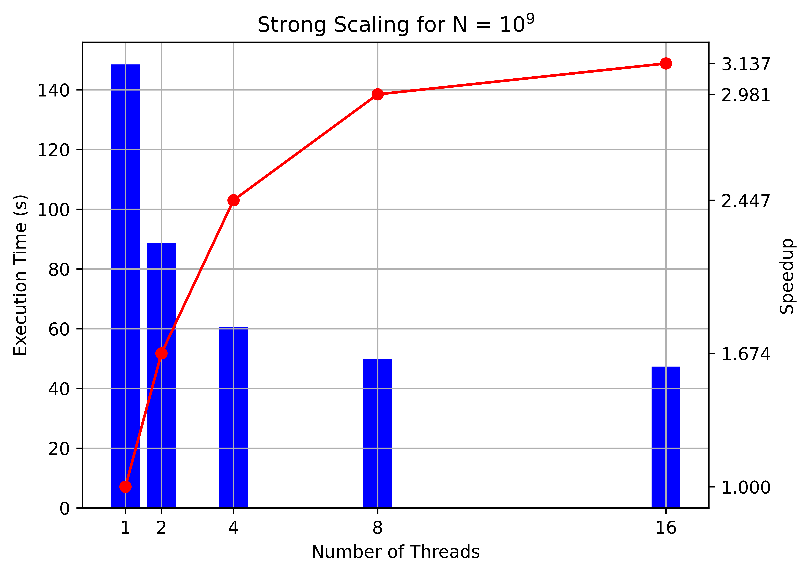

# Distributed Merge-Sort (MPI Implementation)
```bash

# Get the code and compile
git clone https://github.com/gsc74/Merge_Sort_mpi
cd Merge_Sort_mpi
make

# Test
mpirun -np 8 ./Merge_Sort_MPI

# Submit a job to KIAC cluster
sbatch job.sh
```

<p align="center" id="Strong_Scale">
    
</p>

> Strong Scaling of Distributed Merge-Sort on "AMD EPYC 9124 16-Core Processor"

[Slides for tutorial](Merge_Sort_MPI.pdf)

## <a name="pub"></a> References
[Parallel Merge-Sort with MPI (code)](https://github.com/racorretjer/Parallel-Merge-Sort-with-MPI) \
[Merge-Sort (Overview)](https://en.wikipedia.org/wiki/Merge_sort)
